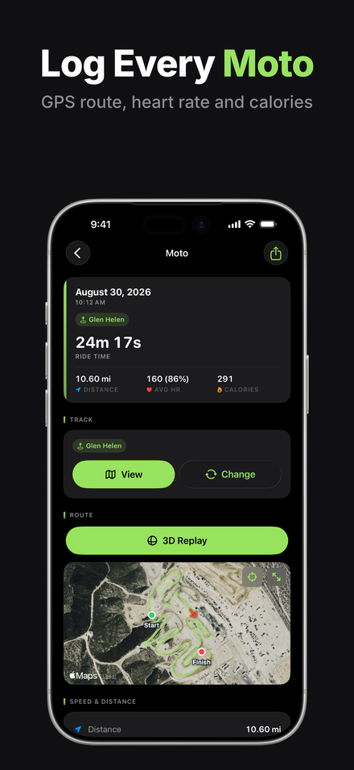
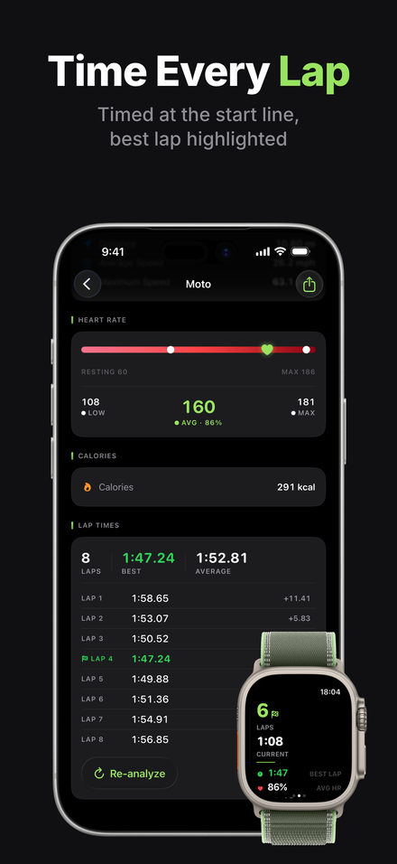
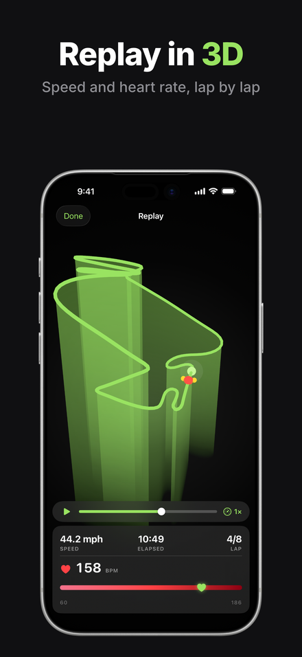
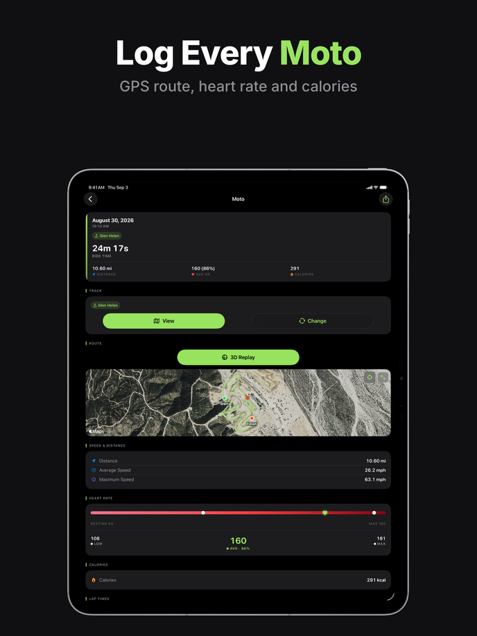
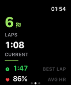
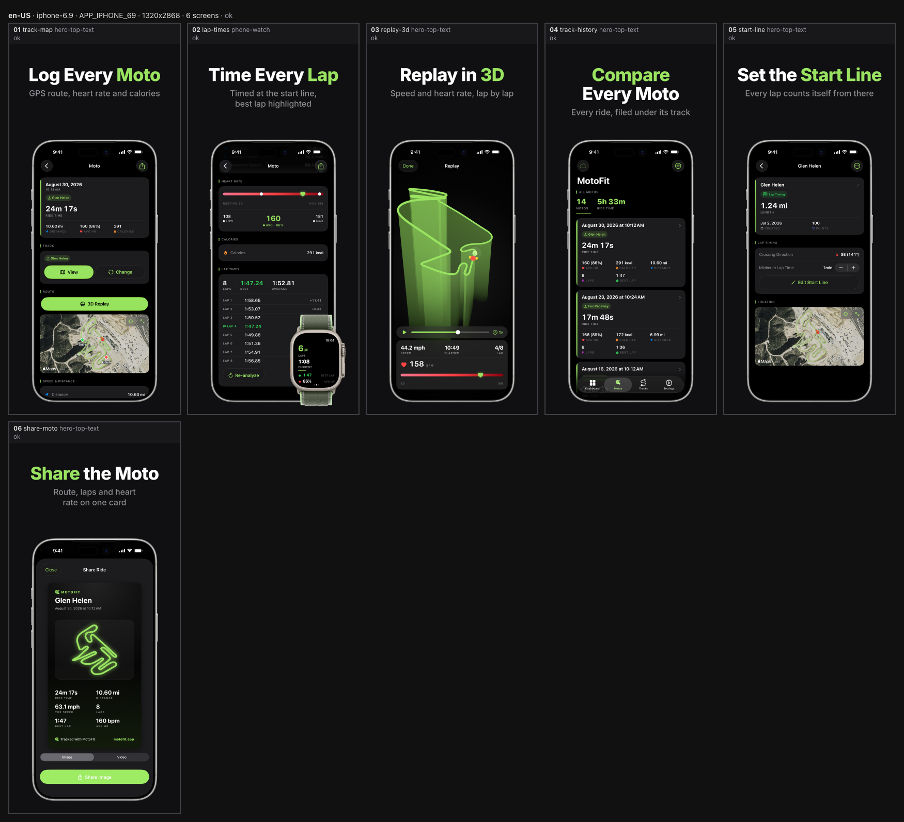

# Screen1Shoter

App Store screenshots as code. Every frame is a React template: the headline is
a string in a JSON file, the app UI inside the frame is a real iOS Simulator
capture, and the device around it is Apple's own product bezel PNG. Headless
Chromium renders the lot to exact-pixel PNGs (1320x2868 for iPhone 6.9",
2064x2752 for iPad 13", 416x496 raw for Apple Watch), so a new size, a new
locale or a one-word copy fix is a re-render, not a new image.

<p align="center">
  
  
  
</p>

Three frames of the [Moto Fit](https://motofit.app) set, the pilot this tool
was built against. Every word above is a string in a JSON file, every device is
an Apple bezel PNG, and every app screen inside one is a simulator capture.

The repo ships two products that share one contract:

- the `s1s` CLI (renderer, bezels, simulator helpers, export pipeline), and
- the `app-store-screenshots` agent skill (`skills/app-store-screenshots/`)
  that drives `s1s` end to end inside Claude Code, Codex or Cursor.

`AGENTS.md` holds the rules for anyone (human or agent) editing this repo.
`CONTRACTS.md` fixes the module boundaries and the browser protocol.

## Why not an image model

An image model draws a picture of a screenshot. This draws the screenshot. The
difference shows up in six places.

**The words are text.** `headline`, `subline` and `highlight` are strings in
`copy/<locale>.json` that Chromium lays out as a DOM text node. They render
exactly as written, every time. A diffusion model redraws every glyph on every
roll, so a lap time of `1:47.24` comes back `1:47.21`, a product name loses a
letter, and you find out at review, or you do not and the store does.

**The frame is Apple's file, not a drawing of one.** Apple's marketing
guidelines require its official product bezels used as-is: no crops, tilts,
shadows or reflections. `s1s bezels install` mounts Apple's DMG, measures each
portrait PNG (device box, screen cut-out, corner radius, Dynamic Island) and
caches the trimmed result. The bezel in the render is that file, positioned
from those measurements. A model-drawn iPhone is a slightly different device
on every frame of the carousel and complies with nothing.

**The app UI is the app.** The pixels inside the cut-out come from
`xcrun simctl io <udid> screenshot`, checked against the preset's capture size
before they are accepted. Apple asks for screenshots of the app in use, and an
invented UI that merely looks plausible is the thing reviewers reject.

**The output is the size the store asks for.** Playwright renders at
`viewport = points, deviceScaleFactor = scale`; sharp then verifies the file.
Wrong dimensions are a hard error, never a silent resize, and alpha is
flattened onto the theme background so nothing ships with a transparent
channel. An image model returns whatever resolution it returns, and resampling
it up to 1320x2868 softens the text you were trying to keep sharp.

**Re-running changes only what you changed.** The clock is pinned to 9:41,
animations and transitions are off, the colour profile is sRGB, and fonts must
load before the shot is taken. Render twice and the hash is identical, so
`s1s render` leaves a screen at `image-approved` or `uploaded` when its hash
has not moved, and flags it only when it has. A re-roll from an image model
changes every frame it touches, so every frame needs approving again.

**A copy fix costs a copy edit.** Screen 2's subline used to read
`Automatic motocross timing, best lap marked`: two labels rather than a
sentence, and the only line in the set that broke the voice of the other five.
The fix was one string and one command:

```jsonc
// screenshots/copy/en-US.json
"subline": "Timed at the start line, best lap highlighted"
```

```sh
s1s render --locale en-US --screens lap-times
```

Two PNGs changed, the iPhone and iPad frames of that one screen. The other
twelve kept their hashes and their status. Nothing was re-shot, no other
headline moved, and what a reviewer reads is one line of a diff.

None of this says image models are useless. They are fine for a background
plate or a piece of concept art that no one has to read. They are the wrong
tool for a surface whose whole job is to state, accurately, what your app does.

## Why this stays maintainable

**Screenshots are source.** `screens.ts`, `theme.ts` and `copy/<locale>.json`
live in the app repo under git. Reviewing a change is `git diff`, not opening
two PNGs side by side and squinting at them.

**The reasoning lives beside the copy.** Every screen carries `notes` (in
`screens.ts`) and `layoutNotes` (in the copy file). They answer, six months
later, the question a PNG cannot. Moto Fit's screen 5, in full:

> The headline said 'Start Gate' until W4c; the visible UI in the same frame
> reads 'Edit Start Line' and 'LAP TIMING', and the app model is StartLine, so
> the reader's eye travelled from headline to button and found a different
> noun. 'Start Line' keeps the verb, the word count and the two-word highlight
> and now matches the image. Do not change the app UI to match the copy, and
> do not reintroduce 'gate' for motocross flavour.

**A locale is a copy file, not a new image set.** Add `copy/de-DE.json` and
render. German runs about 30 % longer than English; the auto-fitter shrinks the
headline inside its budget and reports `text-min-size` when it cannot, so
overflow is a warning in `report.json` rather than something you have to spot.
If the app does not ship that language the captures fall back to the source
locale with an info-level warning, which is recorded rather than hidden.
`docs/w6-de-de-dryrun.md` is the write-up of that run.

**A size is a preset entry.** `iphone-6.7` is an alias of `iphone-6.9`:
rendered once, exported to both store folders. Adding an iPad set to an
iPhone-only project is a `--sizes` flag and a capture pass, not a design pass.

**Problems are machine-readable.** `report.json` records every warning with a
code (`text-clipped`, `capture-missing`, `capture-dims`, `bezel-fallback`,
`copy-unused`, ...). Error-level warnings exit 1, so a broken set cannot be
exported by accident. `review.md` and one contact sheet per size make the same
thing readable by a human in a single glance.

**Adding to a shipped set does not disturb it.** Moto Fit ships a watch app,
but a watch set only appears on the Watch tab of a listing, so no iPhone or
iPad shopper ever saw it. The fix was to give screen 2 the `phone-watch`
template and a second capture ref; a later pass swapped the Series 11 for an
Ultra 3 by changing one size prefix and shooting one 422x514 capture. Both
times the other five iPhone frames kept their bytes, their hashes and their
approval.

**State is in a file, not in someone's head.** `screenshots/manifest.json`
holds the status of every locale x size x screen, so any session resumes where
the last one stopped. `s1s status` reconciles it against `screens.ts` and
against the PNGs on disk, and says so when they disagree:

```
locale  size        NN  screen         status    capture  render   export
en-US   iphone-6.9  01  track-map      uploaded  present  present  present
en-US   iphone-6.9  02  lap-times      uploaded  present  present  present
...
Orphans (in the manifest, not in screens.ts):
  - en-US iphone-6.9 phone-or-watch (captured): screen "phone-or-watch" is not in screens.ts
  - en-US ipad-13 start-line (generated): screen "start-line" no longer applies to ipad-13 (see its `only` list)
```

**Captures are reproducible.** The temporary demo-data changes that put the app
into a photogenic state are kept as `screenshots/captures/demo-data.patch`, so
a re-shoot a year later starts from the same fixtures rather than from
whatever the simulator happens to contain.

## The Moto Fit set

Moto Fit is a motocross lap-timing app for iPhone, iPad and Apple Watch. Its
complete App Store set is 14 PNGs produced from three text files and the
captures beside them.

`screenshots/screens.ts` is the matrix. Data only, so Node reads it for the
render plan and the browser reads it for the templates (comments trimmed here;
the real file carries a paragraph of reasoning per screen):

```ts
import { defineScreens } from 'screen1shoter/config';

export default defineScreens({
  sizes: ['iphone-6.9', 'ipad-13', 'watch-s10'],
  locales: ['en-US'],
  screens: [
    { id: 'track-map', template: 'hero-top-text', only: ['iphone', 'ipad'] },
    {
      id: 'lap-times',
      template: 'phone-watch',
      capture: ['lap-times', 'watch-ultra:watch-lap-ultra'],
      props: { watchVariant: 'natural-trail-loop-green-neon' },
      only: ['iphone', 'ipad'],
    },
    { id: 'replay-3d', template: 'hero-top-text', only: ['iphone', 'ipad'] },
    { id: 'track-history', template: 'hero-top-text', only: ['iphone', 'ipad'] },
    { id: 'start-line', template: 'hero-top-text', only: ['iphone'] },
    { id: 'share-moto', template: 'hero-top-text', only: ['iphone'] },
    { id: 'watch-lap', template: 'raw', only: ['watch-s10'] },
    // ... three more watch scenes
  ],
});
```

`screenshots/copy/en-US.json` holds the words. One entry per screen, plus the
`layoutNotes` that explain them:

```json
"lap-times": {
  "headline": "Time Every Lap",
  "highlight": "Lap",
  "subline": "Timed at the start line, best lap highlighted"
}
```

`screenshots/theme.ts` is the brand, once, for the whole set:

```ts
import { defineTheme } from 'screen1shoter/config';

export default defineTheme({
  background: '#101012',   // just off the app's near-black, so the bezel edge stays visible
  accent: '#99E361',       // Theme.accentRGB, the app's lime
  text: '#FFFFFF',
  textMuted: '#8E8E93',
  highlight: '#99E361',
  headlineWeight: 800,
  headlineCase: 'title',
  bezelVariant: 'silver',
});
```

That produces:

| Size | Store folder | Frames | Template |
|---|---|---|---|
| `iphone-6.9` | `APP_IPHONE_69` | 6 | `hero-top-text`, one `phone-watch` |
| `ipad-13` | `APP_IPAD_PRO_3GEN_129` | 4 | same screens, iPad layout branch |
| `watch-s10` | `APP_WATCH_SERIES_10` | 4 | `raw` passthrough, unframed |

`s1s render` reports 14 rendered, 0 failed, 0 warnings; `s1s export` copies
them to `metadata/screenshots/en-US/<folder>/NN.png`, and
`asc screenshots validate` passes for all three device types.

<p align="center">
  
  
</p>

The same `track-map` screen on iPad (2064x2752, the iPad layout branch of the
same template) and an unframed watch capture (416x496), which passes straight
through without the browser.

Two things in that set are worth pointing at, because they are what a template
buys you over a picture:

- Screen 2 is the whole reason `phone-watch` exists. The watch stands in front
  of the phone's lower right corner, over the lap deltas, which are the least
  load-bearing pixels in the capture. It keeps `hero-top-text`'s text block and
  device box, so the copy band and the phone still sit exactly where they do on
  the other five frames and the bezels line up across the carousel.
- Two frames are iPhone-only. `start-line` and `share-moto` were dropped from
  iPad after both candidates were shot and measured: `TrackDetailView` leaves
  41.7 % of a 13-inch frame black, and the share sheet renders as a small
  centred form sheet whose stats vanish at carousel thumbnail scale. Those
  numbers are in `screens.ts` beside the `only: ['iphone']` that acts on them.

After every render, `s1s render` writes one contact sheet per size: the whole
carousel in a single image, labelled with each screen's id, template and
warning count, so a review is one look rather than six file opens:

<p align="center">
  
</p>

## Prerequisites

- Node 24 (`engines.node`), pnpm 10.33 (`packageManager`).
- Xcode with the iOS Simulator for `s1s capture` and `s1s sim` (rendering
  itself needs no Xcode).
- Playwright's Chromium: `pnpm exec playwright install chromium` if
  `s1s doctor` reports it missing.
- `asc` (App Store Connect CLI) only for validation against the store and for
  uploads; `s1s doctor` reports whether it is on PATH.

## Install

```sh
pnpm install
pnpm link-cli        # ~/.local/bin/s1s -> <checkout>/bin/s1s.js
s1s doctor           # node, tsx, Playwright + Chromium, sharp, bezels, asc, simctl, cli link
```

No build step: `s1s` runs the TypeScript sources through tsx, and the browser
side is served by Vite. Editing the tool takes effect on the next call.

One exception, and it is easy to trip over: a **running** `s1s dev` keeps the
Node modules it loaded at startup. Vite reloads the browser half, and the
watcher picks up changes to the project's copy, captures and manifest, but a
change to the tool's own source is invisible to a server already running.
Restart `s1s dev` after touching `src/`. The symptom is a stale rule applied
to a current config, such as `GET /__s1s/project.json -> 500` with a
`config-invalid` message about a file you just made valid.

## Use in an app repo

```sh
s1s bezels install                                          # once per machine: Apple bezels into ~/.screen1shoter/bezels
cd <app>
s1s init --app-name "My App" --bundle-id com.example.app     # scaffolds <app>/screenshots
s1s render --locale en-US --allow-placeholder               # layout work before any capture exists
s1s sim list && s1s sim status-bar "iPhone 17 Pro Max"
s1s capture --udid "iPhone 17 Pro Max" --name home --device iphone
s1s render --locale en-US                                   # out/en-US/<APP_DISPLAY_TYPE>/NN-<id>.png
s1s dev --open                                              # gallery with HMR
```

Outputs are exact `preset.px`, RGB, no alpha, with 1/3-scale previews,
`report.json`, `review.md` and one contact sheet per size
(`sheet-<sizeId>.png`, every rendered screen in one image) under
`screenshots/out/<locale>/`. A `render --screens <subset>` keeps the other
screens of the previous report in `report.json`, `review.md` and the sheets.
Both watch sizes are passthroughs: the capture (416x496 for `watch-s10`,
422x514 for `watch-ultra`) is copied unframed, and the browser is skipped.

Per-app files live in `<app>/screenshots/`: `screens.ts`, `theme.ts`,
`copy/<locale>.json`, `captures/<locale>/<family>/<name>.png`,
`manifest.json`, optional `templates/`, `assets/` (background and panorama
images) and `fonts/`, and the ignored `out/`. Every `.woff2`, `.woff`, `.ttf`
or `.otf` directly under `fonts/` becomes an `@font-face` rule whose family
and weight come from the file name (`Satoshi-Bold.woff2` -> `Satoshi` 700,
`InterVariable.woff2` -> `Inter` 100-900), so a `theme.fonts` stack can name
it without any registration step.
Exports go to `<app>/metadata/screenshots/<locale>/<APP_DISPLAY_TYPE>/NN.png`,
the layout `asc screenshots upload` reads.

## Commands

| Command | Does |
|---|---|
| `s1s init [--app-name] [--bundle-id] [--app-id] [--locales] [--sizes] [--watch] [--force] [--overwrite-authored]` | Scaffold `<app>/screenshots` (screens.ts, theme.ts, copy, manifest, captures) and link it |
| `s1s link [--cli]` | `--cli`: put `s1s` on PATH; without: link the project's node_modules to this checkout |
| `s1s doctor` | Environment checks: node, tsx, Playwright + Chromium, sharp, bezels, `asc`, simctl, the metadata dir and the CLI link |
| `s1s dev [--locale] [--port] [--open]` | Vite dev server with the `/#/gallery` page |
| `s1s render [--locale] [--sizes] [--screens] [--jobs 4] [--dry-run] [--no-sheet] [--strict] [--allow-placeholder]` | Render one locale: PNGs, previews, report.json (with `sheets`), review.md, contact sheets, manifest render fields |
| `s1s sheet [--locale] [--sizes] [--scale 0.25] [--columns 5]` | Contact sheet per size from the last render (`render` runs it automatically; `--no-sheet` skips it) |
| `s1s capture --udid <udid\|name> --name <ref> [--device iphone\|ipad\|watch] [--locale]` | Screenshot a simulator into `captures/<locale>/<family>/<name>.png`, verify its pixel size and record it in the manifest. `--name` takes a `<sizeId>:<name>` ref, which names the device itself and checks the shot against that size, so a `phone-watch` screen's 422x514 watch capture can be shot in an iPhone-only project |
| `s1s sim list [--all]` | List simulators over `xcrun simctl` |
| `s1s sim status-bar <udid\|name> [--time 9:41] [--clear]` | App Store status bar: 9:41, Wi-Fi, full signal, charged battery (watchOS: reported as unsupported, not an error) |
| `s1s sim appearance <udid\|name> light\|dark` | Switch the simulator UI appearance |
| `s1s bezels install [--device ids] [--all] [--from dmg\|dir] [--keep-dmg] [--force] [--landscape]` | Download Apple's bezel DMGs, measure the PNGs and cache them under `~/.screen1shoter/bezels` (`S1S_HOME` overrides) |
| `s1s bezels list` | Show installed bezels with their screen geometry and which preset uses each one |
| `s1s bezels inspect <dmg-url\|path> [--keep-dmg]` | List the PNGs a DMG (or folder) contains with sizes and proposed id/variant |
| `s1s status [--json] [--set <status> --locale --sizes --screens --from <status>] [--yes]` | Reconcile table: screens.ts vs the manifest vs the PNGs on disk, plus orphaned manifest entries and stray exports (the store is never contacted); `--set` applies a guarded, all-or-nothing status transition, `--from` restricts it to the images at one status, `--yes` confirms a `--set` that covers a whole locale; `--set uploaded` also writes `uploadedAt` and clears `wasUploaded` |
| `s1s export --locale <l> [--sizes] [--metadata-dir metadata/screenshots] [--prune] [--dry-run] [--no-asc]` | Refuse on an incomplete or error-level render; copy to `metadata/screenshots/<locale>/<APP_DISPLAY_TYPE>/NN.png` when the hash differs; `--prune` deletes every `NN.png\|jpg\|jpeg` in the folder this run did not write (others are listed as `stale`); warn on sibling `APP_*` folders with identical dims; run `asc screenshots validate` per size when `asc` is present; print one `asc screenshots upload --version-localization ... --dry-run` command per display type (plus the fan-out form when no duplicate dims) |
| `s1s validate [--metadata-dir] [--locale] [--sizes] [--json]` | Offline check of the export folder: filenames `NN.png\|jpg\|jpeg` contiguous from 01, 1 to 10 per set, dims in `acceptedDims`, no alpha, RGB, uniform dims per set, all-or-nothing across locales, duplicate-dims trap; exit 1 on failure. `--locale` narrows the table (`locales`), never the cross-locale rule: every folder in `scanned` is still compared |

Every command accepts `--json`: stdout is exactly one JSON object
(`{ ok: true, ... }` or `{ ok: false, error: { code, message, hint } }`);
progress and logs go to stderr. `--project <dir>` points at an app repo or its
`screenshots/` dir; the default is a search up from the cwd. Exit codes: 0 ok,
1 failure or error-level warnings, 2 usage.

## Templates

A screen names a template; the template switches on the device family, so one
`screens.ts` entry renders an iPhone layout and an iPad layout without a
second definition. Custom templates go in `<app>/screenshots/templates/`.

| id | Families | Does |
|---|---|---|
| `hero-top-text` | iphone, ipad | Headline and subline on top, whole upright device below. Default. |
| `text-bottom` | iphone, ipad | Whole upright device on top, headline and subline below. |
| `two-device` | iphone, ipad | Two captures in two overlapped upright devices, the front one lower; text on top. |
| `feature-grid` | ipad | Device on the left, up to three callout cards on the right. |
| `phone-watch` | iphone, ipad | `hero-top-text` plus an Apple Watch in front of the device's lower right corner. Two captures. |
| `raw` | iphone, ipad, watch | Unframed capture filling the canvas. Default for watch. |
| `watch-caption` | watch | Watch capture with a short caption. Opt-in. |
| `bleed-bottom` | iphone, ipad | Device cropped at the canvas bottom edge. Opt-in, outside Apple's guidelines. |
| `tilted` | iphone, ipad | Device rotated a few degrees. Opt-in, outside Apple's guidelines. |

The two opt-in templates tag their canvas `data-s1s-noncompliant` and say so in
`review.md`, so nothing leaves the guideline path by accident.

### Choosing the watch in `phone-watch`

The right watch depends on the app: an outdoor or training app wants the
Ultra's rugged titanium case, not a Series 11. Two knobs, each with one job.

- `capture: [<phone>, 'watch-ultra:<watch>']` picks the size. The prefix
  already decided where the capture is read from and what pixel size it must
  be; it also decides which watch is drawn, so the two can never disagree. Use
  it when the app has a real Ultra capture (422x514, from the "Apple Watch
  Ultra 3 (49mm)" simulator).
- `props: { watchBezel: 'apple-watch-ultra-3' }` changes only the frame and
  leaves the capture size alone. Use it to put one 416x496 watch capture in
  another model's frame; the capture is drawn `object-fit: cover`, so the small
  aspect difference crops a couple of percent instead of stretching the app UI.
  `s1s bezels list` prints the installed frames, and `props.watchVariant` names
  the case and band inside one.

## Sizes

| id | displayType | px | capture simulator | notes |
|---|---|---|---|---|
| `iphone-6.9` | `APP_IPHONE_69` | 1320x2868 | iPhone 17 Pro Max | default |
| `iphone-6.7` | `APP_IPHONE_67` | 1320x2868 | iPhone 17 Pro Max | alias of `iphone-6.9`, rendered once, exported twice |
| `iphone-6.5` | `APP_IPHONE_65` | 1284x2778 | iPhone 14 Plus | |
| `iphone-6.1` | `APP_IPHONE_61` | 1206x2622 | iPhone 17 Pro | |
| `ipad-13` | `APP_IPAD_PRO_3GEN_129` | 2064x2752 | iPad Pro 13-inch (M5) | default |
| `ipad-11` | `APP_IPAD_PRO_3GEN_11` | 1668x2420 | iPad Pro 11-inch (M5) | |
| `watch-s10` | `APP_WATCH_SERIES_10` | 416x496 | Apple Watch Series 11 (46mm) | passthrough, unframed |
| `watch-ultra` | `APP_WATCH_ULTRA` | 422x514 | Apple Watch Ultra 3 (49mm) | passthrough, unframed; also accepts 410x502 |

The full table with points, scale and accepted dimensions is in
`CONTRACTS.md` section 3.

## Bezels

`s1s bezels install` fetches Apple's "Bezel-iPhone-17.dmg" (265 MB),
"Bezel-iPad-Pro-(M5).dmg" and "Bezel-Apple-Watch-Series-11-2025.dmg" (341 MB),
mounts them with `hdiutil`, measures every portrait
PNG (device box, screen cut-out, corner radius, Dynamic Island) and writes
trimmed copies plus `index.json` to `~/.screen1shoter/bezels/<id>/<variant>.png`.
The Apple Watch Ultra 3 frame is left out of that default and needs
`--device apple-watch-ultra-3`; only a `phone-watch` screen naming it draws it,
so no project pays for its DMG without asking.
The DMG is deleted after install (and after `bezels inspect <url>`); pass
`--keep-dmg` to keep it under `~/.screen1shoter/dmg`, where a complete file
is reused instead of downloaded again.
Without an installed bezel a render falls back to a generic CSS frame and
reports a `bezel-fallback` warning. `theme.bezelVariant` picks the colour
(`'auto'` = the first variant of the model, e.g. `deep-blue`, `space-black`).
Measured facts and the licence summary are in `docs/bezels.md`. The bezel
PNGs stay in the cache; never commit them.

## Skill

`skills/app-store-screenshots/` is the agent skill that drives the whole
workflow: benefit discovery and copy, temporary demo data, simulator
captures, TSX composition, render and visual QA, human review, export,
optional upload with `asc`, localization and cleanup. Its state lives in the
app repo's `screenshots/manifest.json`, so any session can resume.

Install the skill once per machine from this checkout:

```sh
scripts/install-skills.sh            # symlinks into ~/.agents/skills, ~/.claude/skills, ~/.codex/skills
scripts/install-skills.sh --check    # report link state, change nothing
scripts/install-skills.sh --retire   # archive the three old image-model skills (asks y/N; not run yet)
scripts/install-skills.sh --uninstall
```

The script is idempotent and never overwrites a real directory. The skill
needs `s1s` on PATH (`pnpm link-cli`, then `s1s doctor`).

Invoke it as `/app-store-screenshots [status | plan | capture | compose |
review | export | upload | <locale> | cleanup]` in Claude Code or
`$app-store-screenshots` in Codex. `SKILL.md` is the entry point (under 500
lines); long material lives in `references/`. See
`skills/app-store-screenshots/README.md` for the phase table.

## Develop the tool

```sh
pnpm check         # tsc (node + web) and unit tests
pnpm test:smoke    # renders a copy of example/ through Chromium
pnpm s1s -- render --project example/screenshots --dry-run --json
```

Run `pnpm check && pnpm test:smoke` before every commit. See
`example/screenshots/README.md` for the example project, `CONTRACTS.md` for
the module boundaries and the browser protocol, and `AGENTS.md` for the repo
rules.

## Project status

| Phase | Scope | State |
|---|---|---|
| W1 | Renderer, CLI, core render loop (`init`, `link`, `doctor`, `dev`, `render`, `capture`, `sim`) | done |
| W2 | Apple bezels, contact sheets, iPad and watch sizes, `two-device` and `feature-grid` templates | done |
| W3 | Agent skill `app-store-screenshots`, `scripts/install-skills.sh`, repo docs | done |
| W4 | Moto Fit pilot: demo-data patch, captures, first complete en-US set | done (in the MotoFit repo) |
| W5 | `s1s export`, `s1s validate`, `s1s status`, `asc` integration | done |
| W6 | Opt-in templates (`bleed-bottom`, `tilted`, `watch-caption`), panorama backgrounds, project fonts, de-DE localization dry run | done |
| W7 | Apple Watch bezels, cross-size capture refs, `phone-watch` template | done |
| W8 | Apple Watch Ultra 3 bezel, `watch-ultra` size, a choosable watch model in `phone-watch` | done |

Still open: retiring the three old screenshot skills
(`scripts/install-skills.sh --retire`) needs the user's word, because it
archives skills they may still be using. The de-DE dry run recorded the human
gates instead of asking them, so its copy is unreviewed German; its report,
including the tool defects it found, is `docs/w6-de-de-dryrun.md`.
